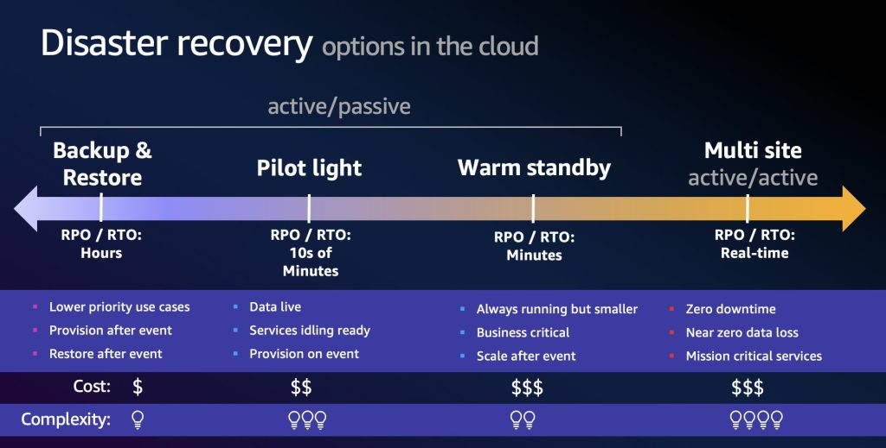
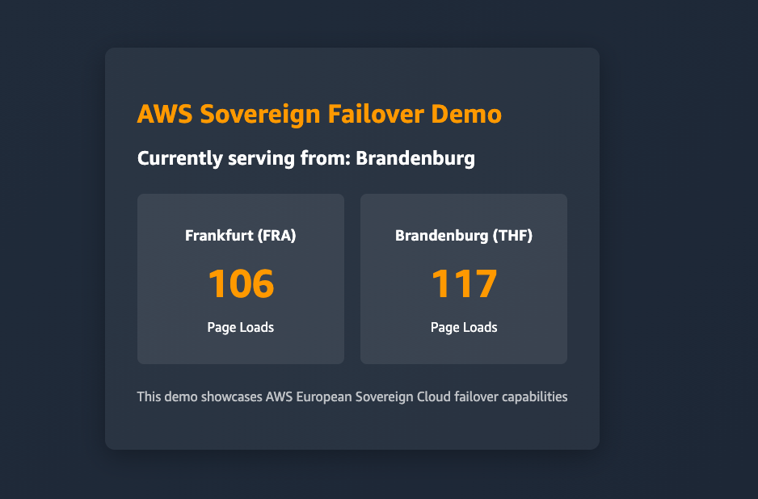
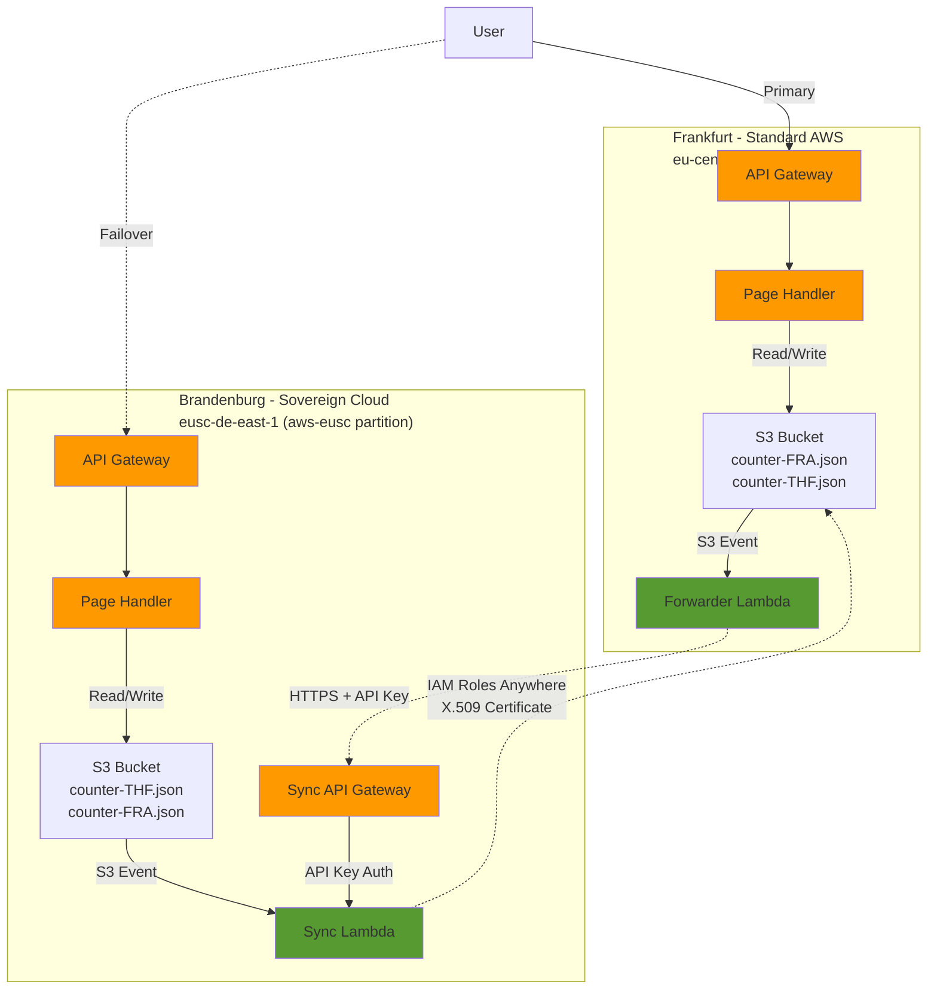
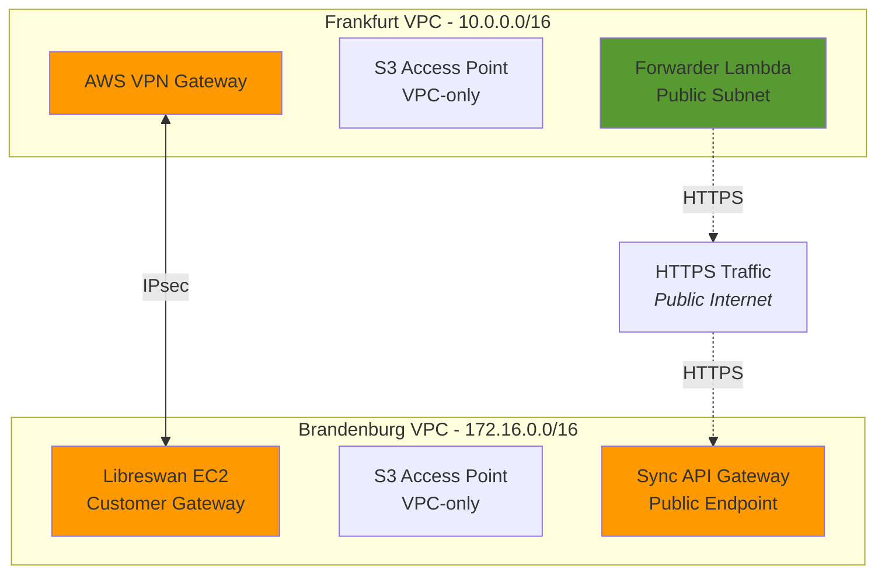

# AWS Sovereign Failover Demo

This sample demonstrates ***sovereign failover*** on AWS. Implementing an automatic failover between the AWS standard partition (region Frankfurt) and the AWS European Sovereign Cloud partition (region Brandenburg), showcasing cross-partition data synchronization using IAM Roles Anywhere with X.509 certificates.

> **Note**: *This project is intended for educational purposes only and not ready for production use. Please work with your security and legal teams to meet your organizational security, regulatory and compliance requirements before deployment. Please be aware cost are incured by deploying this sample.*

Using this sample you can implement the connectivity and authentication for the 4 levels of disaster recovery strategies on AWS. See the diagram below for a recap:



This sample implements a multi site active active disaster recovery and as such can be used to implement connectivity and authentication for all 4 of the strategies above. Each of the strategies backup, pilot Light, warm standby and multi site require to connect the network of the two partitions and to be able to access resources in the other partition to update them. Given the separation of AWS partitions such as the AWS European Sovereign Cloud common strategies otherwise applied to cross region implementations require adaptation. Both partitions come with dedicated IAM services as well as not being connected via the AWS backbone. As such we may wish to provide added private networking or authentication strategies via the public internet. With the connectivity shown in this example you will have both options implemented and can chose which to apply. You will also see strategies to apply unidirectional authentication mechanisms and bidirectional synchronisation. The example uses direct AWS services access whilst still being secured via native AWS services. 

In addition we also detail some approaches you might take to apply synchronisation and how they apply to cross partition architectures differing from cross region architectures in **[Cross-Partition Connections Guide](CROSS_PARTITION_CONNECTIONS.md)** as guide to cross-partition integration methods and authentication options.

We use the simple example of a serverless page view counter to demonstrate synchronisation behavior between the two partitions and regions. This allows you to quickly visualise the connection having been established and working as expected. 



This example is implementing the principles described in these blogposts:
- https://aws.amazon.com/blogs/architecture/sovereign-failover-design-for-digital-sovereignty-using-the-aws-european-sovereign-cloud/
- https://aws.amazon.com/blogs/security/transfer-data-across-aws-partitions-with-iam-roles-anywhere/

## Architecture

The architecture is a bidirectional failover system between two AWS partitions and uses a unidirectional IAM anywhere authentication. Meaning only one side authenticates natively against the other implementing a single sided push and pull synchronization mechanism. This assures the core authentication mechanic is in the sovereign site of the failover strategy. The synchronization architecture is event driven and triggered by S3 update events. The trigger is direct on the sovereign site (push and pull) and transitive via a key authenticated remote api gateway from the commercial site in the sovereign site (also push and pull).

- **Frankfurt (FRA)**: Standard AWS partition (`eu-central-1`)
- **Brandenburg (THF)**: AWS European Sovereign Cloud partition (`eusc-de-east-1`)



**How it works (Bidirectional Flow):**
- Each partition maintains its own page view counter in S3
- When a user visits, the Page Handler increments the local counter and displays both counters
- **THF → FRA**: S3 events trigger Sync Lambda to replicate the THF counter to FRA using IAM Roles Anywhere
- **FRA → THF**: S3 events trigger Forwarder Lambda, which calls THF Sync API Gateway with API Key authentication
- Cross-partition access uses **IAM Roles Anywhere** (THF → FRA) and **API Gateway + API Key** (FRA → THF)
- In both cases the read and write operation is performed via IAM Anywhere from the sync lambda from within the sovereign site (THF)

| Direction | Trigger | Cross-Partition Auth | Local Auth |
|-----------|---------|---------------------|------------|
| **THF → FRA** | S3 Event → Sync Lambda | IAM Roles Anywhere (X.509 cert) | Local IAM role |
| **FRA → THF** | S3 Event → Forwarder → API Gateway → Sync Lambda | API Key (HTTP) + IAM Roles Anywhere (X.509 cert for read) | Local IAM role |

### Network Architecture

The example implements two distinct network connectivity architectures. 

1. **Public Internet Connectivity** (Default): Uses HTTPS for cross-partition communication
2. **Private Network Connectivity** (Optional): Uses IPsec VPN + VPC endpoints for secure, private cross-partition communication

The VPN connection is not required since the synchronization is encrypted over public networks. It is however useful for service internal calls should you desire to keep a private connection for the backend, it is optionally deployed but not used by this sample.



### Authentication Mechanism: X.509 Certificate Signing

This implementation uses IAM Roles Anywhere with X.509 certificates for cross-partition authentication. The Lambda establishes a standard TLS connection to the IAM Roles Anywhere service endpoint, then the `aws_signing_helper` tool uses the X.509 certificate to cryptographically sign the API request to the `CreateSession` API using AWS Signature V4. The IAM Roles Anywhere service validates this certificate signature against the Trust Anchor (which trusts the FRA Private CA), and upon successful validation, issues temporary AWS credentials (access key, secret key, and session token) that the Lambda uses for subsequent S3 operations. This certificate-based signing approach provides strong cryptographic identity verification without requiring long-lived credentials, operating at the application layer where the certificate proves workload identity through request signing, as opposed to mutually authenticated TLS which operates at the transport layer.

## Prerequisites

- Node.js 20.x or later
- AWS CDK CLI (`npm install -g aws-cdk`)
- Two AWS accounts in **different partitions**:
  - One account in the **aws** partition (standard AWS) - for Frankfurt deployment
  - One account in the **aws-eusc** partition (AWS European Sovereign Cloud) - for Brandenburg deployment
- AWS CLI configured with two profiles pointing to these accounts

### Understanding AWS Partitions

This demo requires accounts in two separate AWS partitions:

- **Standard AWS (aws partition)**: The global AWS infrastructure using regions like `eu-central-1` (Frankfurt)
- **AWS European Sovereign Cloud (aws-eusc partition)**: A separate AWS partition designed for European digital sovereignty requirements, operating independently with its own control plane in the `eusc-de-east-1` region (Brandenburg, Germany)

### AWS CLI Configuration

Configure your AWS CLI profiles in `~/.aws/config` and `~/.aws/credentials`:

```ini
# ~/.aws/config
[default]
region = eu-central-1

[profile thf]
region = eusc-de-east-1
```

```ini
# ~/.aws/credentials
[default]
aws_access_key_id = YOUR_FRA_ACCESS_KEY
aws_secret_access_key = YOUR_FRA_SECRET_KEY

[thf]
aws_access_key_id = YOUR_THF_ACCESS_KEY
aws_secret_access_key = YOUR_THF_SECRET_KEY
```

The deployment scripts use the default profile for Frankfurt operations and the `thf` profile (via `--profile thf`) for Brandenburg operations.

## Configuration

The CDK app requires context parameters for cross-partition configuration. These are passed as command-line arguments during deployment and are not hardcoded:

- `fraRemoteAccountId`: THF (Brandenburg) AWS account ID
- `thfRemoteAccountId`: FRA (Frankfurt) AWS account ID

These parameters are provided via the `-c` flag when running CDK commands or through the `deploy-all.sh` script.

## Deployment

> ✅ **Always use the `deploy-all.sh` script for deployments and installations.**

The deployment process has complex cross-partition dependencies that require specific sequencing. The `deploy-all.sh` script handles:

```bash
./scripts/deploy-all.sh <FRA_ACCOUNT_ID> <THF_ACCOUNT_ID>
```

The script will:
1. Install dependencies and build Lambda functions
2. Deploy FRA stack to eu-central-1
3. Deploy THF stack to eusc-de-east-1
4. Issue X.509 certificates from FRA Private CA
5. Create IAM Roles Anywhere Trust Anchors and Profiles
6. Update Lambda environment variables with actual ARNs
7. Configure API Key for FRA → THF synchronization
8. (optional) deploy and configure VPN
9. Display stack outputs and next steps

**Note:** Please make sure you have both the aws cli default profile as well as the aws cli thf profile setup for the script to work.

### Monitoring Synchronization

Check Lambda logs to monitor synchronization:

```bash
# FRA Forwarder Lambda logs
aws logs tail /aws/lambda/FraStack-ForwarderLambda* --follow --region eu-central-1

# THF Sync Lambda logs
aws logs tail /aws/lambda/ThfStack-SyncLambda* --follow --region eusc-de-east-1 --profile thf
```

### Optional: Setup VPN Connection

The VPN connection is optional for this demo (IAM Roles Anywhere works over public internet). But it shows how a working VPN tunnel can be used for private traffic across partitions. You will be prompted if you wish to setup the VPN tunnel as the final step of the `deploy-all.sh`. Alternatively you can use the script directly to set up the VPN:

```bash
./scripts/setup-vpn.sh
```

Check VPN status:
```bash
./scripts/check-vpn.sh
```

## Development

### Making Code Changes

For Lambda function changes:

```bash
# Build specific Lambda
cd lambda/sync-handler  # or lambda/page-handler
npm run build
cd ../..

# Redeploy (use deploy-all.sh to ensure proper configuration)
# Note: deploy-all.sh updates Lambda environment variables after deployment
# to ensure IAM Roles Anywhere ARNs and API Keys are correctly configured
./scripts/deploy-all.sh <FRA_ACCOUNT_ID> <THF_ACCOUNT_ID>
```

### Making Infrastructure Changes

For CDK stack changes:

```bash
# Build CDK code
npm run build

# Preview changes
npm run diff

# Deploy changes (always use deploy-all.sh)
./scripts/deploy-all.sh <FRA_ACCOUNT_ID> <THF_ACCOUNT_ID>
```

### Useful Scripts

```bash
# Check VPN connection status
./scripts/check-vpn.sh

# Update Lambda environment variables after manual changes
./scripts/update-sync-lambdas.sh

# Re-issue certificates (if expired or compromised)
./scripts/issue-certificates.sh --fra-profile default --thf-profile thf
```

## License

MIT-0

## DNS-Based Failover with Route 53

This sample focuses on cross-partition connectivity, authentication and synchronisation mechanisms required for sovereign failover. DNS-based routing and failover using Amazon Route 53 has been intentionally left out and works similarly to multi-region setups in a cross-partition architecture. Amazon Route 53 is also available in the AWS European Sovereign Cloud.

- [Amazon Route 53: Choosing a routing policy](https://docs.aws.amazon.com/Route53/latest/DeveloperGuide/routing-policy.html)

## Resources

- [AWS Blog: Sovereign Failover Design for Digital Sovereignty](https://aws.amazon.com/blogs/architecture/sovereign-failover-design-for-digital-sovereignty-using-the-aws-european-sovereign-cloud/)
- [AWS Blog: Transfer data across AWS partitions with IAM Roles Anywhere](https://aws.amazon.com/blogs/security/transfer-data-across-aws-partitions-with-iam-roles-anywhere/)
- [IAM Roles Anywhere Documentation](https://docs.aws.amazon.com/rolesanywhere/latest/userguide/introduction.html)
- [AWS Private CA Documentation](https://docs.aws.amazon.com/privateca/latest/userguide/PcaWelcome.html)
- [Cross-Partition Connections Guide](CROSS_PARTITION_CONNECTIONS.md)
